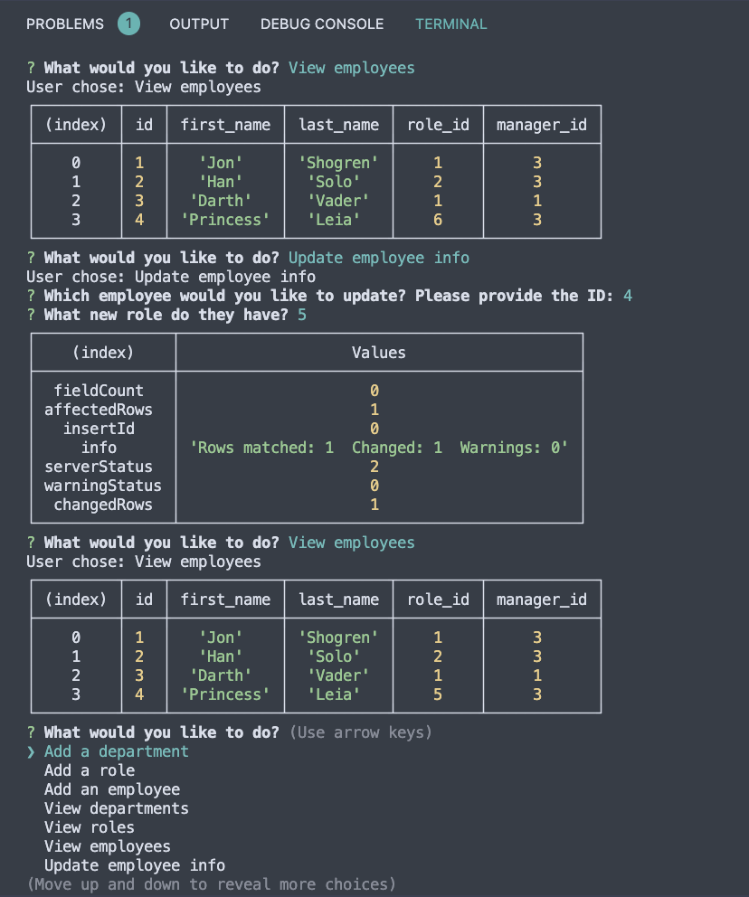

# 12-Employee-Tracker

## Description

This is the module 12 "Employee Tracker" by Jonathan Shogren. The challange was to create command line interface that allows users to view and manage their employees, and store that information in a database.

## User Story

```md
AS A business owner
I WANT to be able to view and manage the departments, roles, and employees in my company
SO THAT I can organize and plan my business
```

## Screenshot

Here is a screenshot of the finished site that was created with this tool:



## Additional Notes

* Here is a link to the [video walkthrough](hhttps://watch.screencastify.com/v/NbyoJmPBV1N9ngh7mspq)
